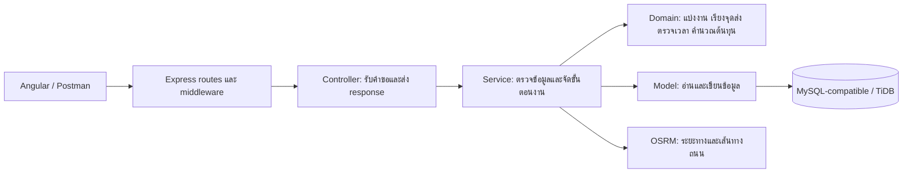

# คู่มือ API ระบบ Smart Lunch Routing

คู่มือสำหรับผู้พัฒนา ผู้ทดสอบ และผู้จัดทำเอกสารระบบจัดเส้นทางส่งข้าวกล่อง อ้างอิงโค้ดใน `src` ของ repository backend ที่ตรวจเมื่อ 7 ตุลาคม 2026 พฤติกรรมบนเซิร์ฟเวอร์จะตรงกับคู่มือนี้เมื่อ deploy โค้ดและ migration ที่สอดคล้องกัน

โค้ดหลักที่อ้างอิงอยู่ใน repository [Fokkio/smart-lunch-routing-backend](https://github.com/Fokkio/smart-lunch-routing-backend) ที่ commit [`eddf759`](https://github.com/Fokkio/smart-lunch-routing-backend/commit/eddf759fa07b31fceba4bcaa53cd01169cdfd58b) ซึ่งเป็น main ที่ fetch ก่อนเตรียม PR ลิงก์โค้ดในคู่มือระบุ commit นี้เพื่อให้ตรวจสอบพฤติกรรมย้อนหลังได้

ตัวอย่าง ID บัญชี เบอร์โทร พิกัด และผลคำนวณในเอกสารเป็นข้อมูลสมมติ ไม่ใช่ข้อมูลจากเซิร์ฟเวอร์จริง

## สารบัญ

1. [ภาพรวมระบบและสถาปัตยกรรม](#1-ภาพรวมระบบและสถาปัตยกรรม)
2. [รูปแบบคำขอและสิทธิ์ใช้งาน](#2-รูปแบบคำขอและสิทธิ์ใช้งาน)
3. [ลำดับใช้งานตั้งแต่รับออเดอร์จนส่งสำเร็จ](#3-ลำดับใช้งานตั้งแต่รับออเดอร์จนส่งสำเร็จ)
4. [API ตรวจสถานะและบัญชี](#4-api-ตรวจสถานะและบัญชี)
5. [API ลูกค้า](#5-api-ลูกค้า)
6. [API ออเดอร์](#6-api-ออเดอร์)
7. [API ไรเดอร์](#7-api-ไรเดอร์)
8. [API ตั้งค่าร้าน](#8-api-ตั้งค่าร้าน)
9. [API แผนจัดส่ง](#9-api-แผนจัดส่ง)
10. [API งานของไรเดอร์](#10-api-งานของไรเดอร์)
11. [วิธีคำนวณเส้นทาง เวลา และต้นทุน](#11-วิธีคำนวณเส้นทาง-เวลา-และต้นทุน)
12. [สถานะข้อมูลและการป้องกันข้อมูลเปลี่ยนระหว่างทำงาน](#12-สถานะข้อมูลและการป้องกันข้อมูลเปลี่ยนระหว่างทำงาน)
13. [ข้อผิดพลาดและวิธีจัดการ](#13-ข้อผิดพลาดและวิธีจัดการ)
14. [แนวทางทดสอบด้วย Postman](#14-แนวทางทดสอบด้วย-postman)
15. [ข้อจำกัดที่ต้องอธิบายในเอกสาร](#15-ข้อจำกัดที่ต้องอธิบายในเอกสาร)
16. [ไฟล์อ้างอิงสำหรับปรับปรุงคู่มือ](#16-ไฟล์อ้างอิงสำหรับปรับปรุงคู่มือ)

## 1. ภาพรวมระบบและสถาปัตยกรรม

Frontend Angular ส่งคำขอ HTTP ไปยัง backend ที่ใช้ Express และ TypeScript ส่วน backend อ่านและเขียนฐานข้อมูลผ่าน `mysql2/promise` ซึ่งรองรับฐานข้อมูล MySQL-compatible เช่น TiDB ระบบเรียก OSRM เพื่อหาระยะทาง เวลาเดินทาง และเส้นทางถนนสำหรับแสดงบนแผนที่



CRUD ทั่วไปผ่าน controller → service → model ส่วนการสร้างแผนจัดส่งเรียก domain และ OSRM เพิ่มเติม บาง route เช่น auth, settings และงานไรเดอร์เรียก model หรือฐานข้อมูลโดยตรง จึงไม่ใช่ทุก endpoint ที่ผ่านทุกชั้นในแผนภาพ

ข้อมูลหลักอยู่ในตาราง `customers`, `orders`, `riders`, `shop_settings`, `route_plans`, `delivery_jobs`, `delivery_job_orders` และตารางบัญชี/session แผนหนึ่งมีหลายใบงาน และใบงานหนึ่งมีจุดส่งเรียงตามลำดับ

## 2. รูปแบบคำขอและสิทธิ์ใช้งาน

กำหนด `baseUrl` เป็น URL ของ backend เช่น `http://localhost:3000` สำหรับเครื่องพัฒนา หรือ URL ที่ deploy จริง เส้นทาง API ส่วนใหญ่ขึ้นต้นด้วย `/api`

คำขอที่มี body ใช้ JSON:

```http
Content-Type: application/json
Authorization: Bearer <token ที่ได้จาก login>
```

API ส่งชื่อฟิลด์แบบ camelCase ใช้วันที่ `YYYY-MM-DD` และ ID เป็นจำนวนเต็มบวก เวลาใน response แผนส่วนใหญ่เป็น `HH:MM` พิกัดลูกค้าใช้ `lat`/`lng` แต่พิกัดใน settings และจุดส่งใช้ `latitude`/`longitude` ส่วน GeoJSON ใช้คู่พิกัด `[longitude, latitude]`

| ผู้ใช้ | API ที่เข้าถึงได้ |
|---|---|
| ไม่เข้าสู่ระบบ | `GET /`, `GET /api/health`, `POST /api/auth/login` |
| OWNER | `/api/customers`, `/api/orders`, `/api/riders`, `/api/settings`, `/api/route-plans` และ auth ที่อนุญาต |
| RIDER | `/api/my-jobs`, `/api/auth/password` และ auth ที่อนุญาต |
| OWNER หรือ RIDER | `GET /api/auth/me`, `POST /api/auth/logout` |

ไม่มี token หรือ token ใช้ไม่ได้ตอบ `401` มี token ถูกต้องแต่บทบาทไม่ตรงตอบ `403` ระบบใช้ Bearer token ที่มี session ในฐานข้อมูล ไม่ใช่ JWT

CORS อ่านจาก `CORS_ORIGIN` ซึ่งระบุหลาย origin คั่นด้วย comma ได้ หากรายการว่าง โค้ดอนุญาตทุก origin คำขอจาก origin ที่ไม่อนุญาตตอบ `403`

## 3. ลำดับใช้งานตั้งแต่รับออเดอร์จนส่งสำเร็จ

1. เจ้าของร้าน login แล้วเก็บ token สำหรับเรียก API ฝั่ง OWNER
2. เตรียมค่าร้าน พิกัดลูกค้า และออเดอร์ของวันที่ต้องส่ง
3. สร้างไรเดอร์ ตั้ง username/password และเปิดความพร้อมรับงาน
4. เรียก `POST /api/route-plans/generate` เพื่อสร้างแผนฉบับร่าง
5. ตรวจรายละเอียดระยะทาง เวลา ค่าใช้จ่าย กำไร และจุดส่ง หากต้องการแผนทางเลือกเรียก `/recalculate`
6. เรียก `POST /api/route-plans/:id/select` เพื่อยืนยันแผนและมอบหมายงานจริง
7. ไรเดอร์ login และเรียก `GET /api/my-jobs?date=...` เพื่อดูงานที่ยืนยันแล้วของตน
8. ไรเดอร์รับทราบงาน เริ่มส่ง และบันทึกส่งสำเร็จทีละจุดตามลำดับ
9. เมื่อส่งครบทุกจุด ใบงานเปลี่ยนเป็น `COMPLETED` และออเดอร์เหล่านั้นเป็น `DELIVERED`

การสร้างแผนยังไม่เปลี่ยนสถานะออเดอร์ การเลือกแผนต่างหากที่เปลี่ยน `PENDING` เป็น `PLANNED` และทำให้งานปรากฏใน API ของไรเดอร์

## 4. API ตรวจสถานะและบัญชี

| Method | Path | ผลสำเร็จ | การทำงาน |
|---|---|---|---|
| GET | `/` | 200 | ส่งชื่อ service และ `status: "ok"` |
| GET | `/api/health` | 200 | ส่ง `{"status":"ok"}` |
| POST | `/api/auth/login` | 200 | ตรวจบัญชีและสร้าง session |
| GET | `/api/auth/me` | 200 | ส่ง identity ของ token ปัจจุบัน |
| POST | `/api/auth/logout` | 204 | ลบ session ของ token ปัจจุบัน |
| PUT | `/api/auth/password` | 204 | RIDER เปลี่ยนรหัสผ่านตนเองและเพิกถอนทุก session ของบัญชีนั้น |

`/` และ `/api/health` ไม่ตรวจการเชื่อมต่อฐานข้อมูล จึงใช้ยืนยันได้เพียงว่า Express ตอบคำขอได้ ไม่ได้ยืนยันว่าระบบ CRUD หรือจัดเส้นทางพร้อมใช้งาน

ตัวอย่าง login:

```json
{
  "role": "OWNER",
  "username": "<บัญชีเจ้าของร้าน>",
  "password": "<รหัสผ่าน>"
}
```

ตัวอย่าง response:

```json
{
  "token": "<session token>",
  "user": { "type": "OWNER", "id": 1, "name": "เจ้าของร้านตัวอย่าง" }
}
```

สำหรับไรเดอร์ใช้ `role: "RIDER"` และ username ที่เจ้าของร้านตั้งให้ โค้ดยังรองรับเลข rider ID เป็น username เพื่อความเข้ากันได้กับข้อมูลเก่า

Session มีอายุ 12 ชั่วโมง หาก login ผิด 5 ครั้งภายในช่วง 15 นาที บัญชีที่ใช้ลอง login จะถูกบล็อก 15 นาที ครั้งที่ทำให้ครบ 5 ครั้งยังตอบ `401` และคำขอขณะถูกบล็อกตอบ `429` การ login สำเร็จล้างประวัติความล้มเหลวของ subject นั้น

ตัวอย่างเปลี่ยนรหัสผ่านของ RIDER:

```json
{
  "currentPassword": "<รหัสผ่านเดิม>",
  "newPassword": "<รหัสผ่านใหม่>"
}
```

รหัสผ่านที่ตั้งใหม่ต้องมีอย่างน้อย 12 ตัวอักษร และไม่เกิน 72 UTF-8 bytes ระบบเก็บ bcrypt hash ไม่ส่งรหัสผ่านกลับใน API หลังเปลี่ยนรหัสผ่านต้อง login ใหม่

## 5. API ลูกค้า

ทุก endpoint ในส่วนนี้ต้องใช้ OWNER token

| Method | Path | ผลสำเร็จ | รายละเอียด |
|---|---|---|---|
| GET | `/api/customers` | 200 | ส่ง array ลูกค้าทั้งหมด |
| GET | `/api/customers?search=คำค้น` | 200 | ค้นบางส่วนของชื่อ เบอร์โทร หรือที่อยู่ |
| GET | `/api/customers/nearby?radiusKm=...` | 200 | ลูกค้าภายในรัศมีจากร้าน เรียงระยะใกล้ก่อน |
| GET | `/api/customers/:id` | 200 | รายละเอียดลูกค้าหนึ่งราย |
| POST | `/api/customers` | 201 | เพิ่มลูกค้า |
| PUT | `/api/customers/:id` | 200 | แก้ไขเฉพาะฟิลด์ที่ส่งมา |
| DELETE | `/api/customers/:id` | 204 | ลบลูกค้าที่ไม่มีออเดอร์อ้างอิง |

ตัวอย่าง body เพิ่มลูกค้า:

```json
{
  "name": "ลูกค้าทดสอบ A",
  "phone": "0800000001",
  "address": "ที่อยู่สมมติสำหรับทดสอบ",
  "lat": 16.245,
  "lng": 103.25
}
```

ต้องมี `name`, `phone`, `lat`, `lng` ชื่อไม่ว่างและยาวไม่เกิน 150 ตัวอักษร เบอร์โทรต้องเป็น string เพื่อรักษาเลข 0 หน้าเบอร์ ระบบตัดช่องว่างและขีดออกแล้วตรวจมือถือไทย 10 หลักที่ขึ้นต้น 06, 08 หรือ 09 เบอร์ซ้ำตอบ `409` พิกัดต้องอยู่ในช่วง latitude −90 ถึง 90 และ longitude −180 ถึง 180

Response ใช้ฟิลด์ `id`, `name`, `phone`, `address`, `lat`, `lng` และอาจมี `createdAt` หาก PUT ไม่ส่ง address จะคงค่าเดิม; ส่ง `address: null` จะล้างที่อยู่

Nearby อ่านพิกัดร้านจาก settings ในฐานข้อมูล ไม่ใช้ `lat`/`lng` ที่ client ส่งมา ค่า `radiusKm` เริ่มต้น 1 กม. รับจำนวน finite มากกว่า 0 รวมทศนิยม และไม่มีเพดาน 50 กม. ใน validation รุ่นนี้ ระยะที่ส่งใน `distanceKm` เป็นระยะเส้นตรงจาก Haversine ไม่ใช่ระยะถนน

## 6. API ออเดอร์

ทุก endpoint ในส่วนนี้ต้องใช้ OWNER token

| Method | Path | ผลสำเร็จ | รายละเอียด |
|---|---|---|---|
| GET | `/api/orders` | 200 | ส่ง array ออเดอร์ |
| GET | `/api/orders?date=...&status=...&customerId=...` | 200 | กรองด้วยฟิลด์ที่ส่งมา; ใช้ร่วมกันได้ |
| GET | `/api/orders/nearby?radiusKm=...&date=...&status=...` | 200 | ออเดอร์ที่ลูกค้าอยู่ในรัศมีจากร้าน พร้อมตัวกรองวัน/สถานะ optional |
| GET | `/api/orders/:id` | 200 | รายละเอียดออเดอร์ |
| POST | `/api/orders` | 201 | เพิ่มออเดอร์ |
| PUT | `/api/orders/:id` | 200 | แก้ไขออเดอร์ที่ยังแก้ไขได้ |
| DELETE | `/api/orders/:id` | 204 | ลบออเดอร์ที่ไม่มีแผนอ้างอิง |
| POST | `/api/orders/simulate` | 201 | สร้างออเดอร์จำลอง |
| DELETE | `/api/orders/simulated` | 200 | ลบออเดอร์จำลองเฉพาะ ID ที่ส่งใน body |

ตัวอย่าง body เพิ่มออเดอร์:

```json
{
  "customerId": 1,
  "boxes": 2,
  "orderDate": "2026-10-07"
}
```

`customerId` ต้องอ้างถึงลูกค้าที่มีอยู่ และ `boxes` เป็นจำนวนเต็ม 1–3 การสร้างใหม่ใช้สถานะ `PENDING` เท่านั้น หากไม่ส่ง `orderDate` จะใช้วันที่ปัจจุบันตาม Asia/Bangkok การระบุวันที่ชัดเจนยังช่วยให้ทดสอบข้อมูลของวันเป้าหมายได้ตรงกัน

Response ออเดอร์มี `id`, `customerId`, `boxes`, `status`, `orderDate`, `isSimulated` และอาจมี `createdAt` สถานะที่อ่านได้คือ `PENDING`, `PLANNED`, `DELIVERING`, `DELIVERED`, `CANCELLED` ส่วน PUT เปลี่ยนได้เฉพาะ PENDING/CANCELLED และแก้ได้เมื่อออเดอร์เดิมอยู่ในสองสถานะนี้และไม่ติดแผนยืนยัน สถานะจัดส่งต้องเปลี่ยนผ่านใบงาน ระบบแปลง status ของ CRUD ปกติเป็นตัวพิมพ์ใหญ่

Nearby ใช้พิกัดร้านจาก settings มีรัศมีเริ่มต้น 2 กม. รับจำนวน finite มากกว่า 0 และเพิ่ม `customerName`, `customerLat`, `customerLng`, `distanceKm` ในผลลัพธ์ หากไม่ส่งตัวกรองจะค้นทุกวัน/ทุกสถานะ กรองด้วย `date` และ `status` ได้ โดย status ของ endpoint นี้ต้องใช้ตัวพิมพ์ใหญ่ เช่น `PENDING` ไม่ใช้ `customerId` เป็นตัวกรองใน nearby

ตัวอย่างจำลองออเดอร์:

```json
{ "count": 25, "orderDate": "2026-10-07" }
```

`count` รับจำนวนเต็ม 20–30 ค่าเริ่มต้น 25 ระบบวนเลือกลูกค้าที่มีอยู่ตาม ID และวนจำนวนกล่อง 1, 2, 3 จึงเป็นข้อมูลจำลองแบบกำหนดลำดับ ไม่ได้สุ่มสร้างลูกค้าหรือพิกัดใหม่ หากยังไม่มีลูกค้าตอบ `422`

Response จำลองเป็น `{"createdCount":25,"orders":[...]}` ส่วนการล้างข้อมูลจำลองต้องส่ง body ระบุ ID:

```json
{ "orderIds": [101, 102, 103] }
```

รับ ID จำนวน 1–500 รายการ เป็นจำนวนเต็มบวกและไม่ซ้ำ ตอบ `{"deletedCount":3}` ตามจำนวนที่ลบจริง ลบเฉพาะ ID ที่เป็นออเดอร์จำลอง ไม่จำกัดวัน หากมีแผนอ้างอิงจะตอบ `409` ให้ลบแผนที่เกี่ยวข้องก่อน

## 7. API ไรเดอร์

ทุก endpoint ในส่วนนี้ต้องใช้ OWNER token

| Method | Path | ผลสำเร็จ | รายละเอียด |
|---|---|---|---|
| GET | `/api/riders` | 200 | รายชื่อไรเดอร์พร้อมสถานะงาน |
| GET | `/api/riders?available=true` | 200 | เฉพาะไรเดอร์ที่พร้อมมอบหมายงาน |
| POST | `/api/riders` | 201 | เพิ่มข้อมูลไรเดอร์ |
| PUT | `/api/riders/:id` | 200 | แก้ชื่อ เบอร์โทร หรือความพร้อม |
| DELETE | `/api/riders/:id` | 204 | ลบไรเดอร์ที่ไม่มีใบงานอ้างอิง |
| PUT | `/api/riders/:id/account` | 204 | ตั้ง username และตั้ง/เปลี่ยน password |
| PUT | `/api/riders/:id/password` | 204 | ตั้ง/รีเซ็ตรหัสผ่านและเปิดการ login |

ไม่มี route `GET /api/riders/:id` แม้ service/model มีฟังก์ชันค้นตาม ID

ตัวอย่างเพิ่มไรเดอร์:

```json
{ "name": "ไรเดอร์ทดสอบ A", "phone": "0800000002", "isAvailable": true }
```

บังคับชื่อ 1–150 ตัวอักษร เบอร์โทรเป็น optional และใช้ `null` ได้ ถ้าส่งเบอร์ต้องเป็นมือถือไทยตามรูปแบบเดียวกับลูกค้า `isAvailable` ต้องเป็น boolean และค่าเริ่มต้นตอนสร้างเป็น true

การสร้างข้อมูลไรเดอร์ยังไม่ตั้งบัญชี login ให้ ต้องเรียก account เพิ่ม:

```json
{ "username": "rider_test_a", "password": "<รหัสผ่านตามเงื่อนไข>" }
```

Username ถูก trim และแปลงเป็นตัวพิมพ์เล็ก ความยาว 3–40 ตัว เริ่มด้วย a–z และใช้ a–z, 0–9, จุด, ขีดล่าง, ขีดกลางได้ ชื่อรูปแบบ `rider_<เลข>` ใช้ได้เมื่อเลขตรงกับ rider ID เท่านั้น การตั้งบัญชีครั้งแรกต้องมี password ส่วนครั้งต่อไปส่งเฉพาะ username เพื่อคง password เดิมได้ Username ซ้ำตอบ `409`

Endpoint password รับ `{"password":"<รหัสผ่าน>"}` แต่ไม่ได้ตั้ง username ให้ ทั้ง account และ password เพิกถอนทุก session ของไรเดอร์นั้น

ผลลัพธ์ข้อมูลไรเดอร์มี `id`, `name`, `username`, `hasPassword`, `phone`, `isAvailable` และข้อมูล workload เช่น `workStatus`, `assignedOrdersToday` ค่า workStatus อาจเป็น `READY`, `BUSY`, `DELIVERING`, `PAUSED`, `UNCONFIGURED`

ไรเดอร์ที่พร้อมสำหรับวางแผนต้อง available, ACTIVE, เปิด login, มี username/password และไม่มีออเดอร์ `PLANNED` หรือ `DELIVERING` ในแผนที่เลือกไว้ การเช็กงานค้างครอบคลุมทุกวัน ระบบจัดลำดับผู้พร้อมตามจำนวนออเดอร์ที่ได้รับในวันวางแผน เวลามอบหมายล่าสุด และ ID

## 8. API ตั้งค่าร้าน

OWNER เรียก `GET /api/settings` เพื่ออ่าน และ `PUT /api/settings` เพื่อแก้เฉพาะฟิลด์ที่ส่งมา ทั้งสองตอบ 200 พร้อมข้อมูล settings

| ฟิลด์ | ความหมาย | เงื่อนไข/ค่าตั้งต้นใน schema |
|---|---|---|
| `shopName` | ชื่อร้าน | ไม่ว่าง ยาวไม่เกิน 150 |
| `latitude`, `longitude` | พิกัดร้าน | number ในช่วงพิกัดที่ถูกต้อง |
| `deliveryStartTime` | เวลาเริ่มส่ง | `HH:MM` หรือ `HH:MM:SS`; ตั้งต้น 11:30 |
| `deliveryDeadline` | เวลาส่งเสร็จ | ต้องหลังเวลาเริ่ม; ตั้งต้น 12:30 |
| `maxOrdersPerRider` | ออเดอร์สูงสุดต่อใบงาน | จำนวนเต็ม 1–3; ตั้งต้น 3 |
| `riderSpeedKmh` | ความเร็วสำหรับประมาณเวลาเมื่อ fallback | มากกว่า 0 ถึง 120; ตั้งต้น 30 |
| `boxSalePrice` | ราคาขายต่อกล่อง | ตั้งต้น 65 |
| `boxFoodCost` | ต้นทุนอาหารต่อกล่อง | ตั้งต้น 40 |
| `riderBaseCost` | ค่าจ้างเริ่มต้นต่อใบงาน | ตั้งต้น 15 |
| `riderCostPerKm` | บาทต่อกม.ต่อกล่องในใบงาน | ตั้งต้น 2 |
| `stopServiceMinutes` | เวลาบริการเพิ่มต่อจุดส่ง | จำนวนเต็ม 0–30; ตั้งต้น 0 |

ฟิลด์จำนวนเงินรับ number ตั้งแต่ 0 ถึง 1,000,000 ค่าที่ใช้งานจริงอ่านจากฐานข้อมูล ไม่ได้ยึดค่าตั้งต้นตลอดไป ส่งฟิลด์ที่ไม่อยู่ในรายการตอบ `400`

การแก้ settings ทำให้แผนฉบับร่าง `GENERATED` ทั้งหมดเป็น `REJECTED` แผนที่ยืนยันแล้วใช้ snapshot เดิม หากมีแผนยืนยันแบบเก่าที่ไม่มี snapshot ระบบอาจตอบ `409` ให้ปรับข้อมูลแผนเก่าก่อน

## 9. API แผนจัดส่ง

ทุก endpoint ในส่วนนี้ต้องใช้ OWNER token

| Method | Path | ผลสำเร็จ | รายละเอียด |
|---|---|---|---|
| POST | `/api/route-plans/generate` | 201 | สร้างและบันทึกแผนใหม่ |
| POST | `/api/route-plans/recalculate` | 201 | สร้างแผนทางเลือกใหม่ |
| GET | `/api/route-plans` | 200 | รายการสรุปทุกแผน |
| GET | `/api/route-plans?date=YYYY-MM-DD` | 200 | รายการสรุปของวันที่ระบุ |
| GET | `/api/route-plans/:id` | 200 | แผนเต็มพร้อม jobs/stops/geometry |
| POST | `/api/route-plans/:id/select` | 200 | ยืนยันและมอบหมายแผน |
| DELETE | `/api/route-plans/:id` | 204 | ลบแผนและใบงาน/จุดส่งของแผนนั้น |

Body สำหรับ generate:

```json
{
  "planDate": "2026-10-07",
  "startTime": "11:30",
  "deadline": "12:30",
  "orderIds": [1, 2, 3]
}
```

บังคับ `planDate` ส่วนอีกสามฟิลด์เป็น optional หากไม่ส่งเวลาใช้ settings ร้าน หากไม่ส่ง `orderIds` ใช้ออเดอร์ PENDING ทั้งหมดของวันนั้น ถ้าส่ง orderIds ต้องไม่ว่าง ไม่ซ้ำ เป็นจำนวนเต็มบวก และทุก ID ต้องยังเป็น PENDING ของวันที่ระบุ เวลาเริ่มต้องก่อน deadline ในวันเดียวกัน

Recalculate ต้องส่ง `basePlanId` ของแผน GENERATED ปัจจุบันที่มี planDate ตรงกัน:

```json
{ "planDate": "2026-10-07", "basePlanId": 7 }
```

ส่ง startTime/deadline/orderIds เพิ่มเพื่อปรับรอบได้ หากไม่ส่งใช้เวลาและออเดอร์จากแผนฐาน ทุกครั้งที่ generate/recalculate สำเร็จสร้าง routePlanId ใหม่ ไม่เขียนทับแผนเดิม Recalculate ค้นทางเลือกที่ลำดับ/กลุ่มจุดส่งต่างจากแผนฐาน ภายในขอบเขตการค้นที่กำหนด หากหาไม่ได้ตอบ `422` จึงไม่ควรเขียนว่าได้แผนทางเลือกเสมอ หรือว่าผลใหม่ต้องถูกกว่าเดิม หากส่ง basePlanId เดิมซ้ำอาจได้ทางเลือกเดิมอีกครั้ง

รายการสรุปมีข้อมูลต่อไปนี้ แต่ไม่มี `jobs`:

```json
{
  "routePlanId": 7,
  "planDate": "2026-10-07",
  "status": "GENERATED",
  "startTime": "11:30",
  "deliveryDeadline": "12:30",
  "routingSource": "ROAD",
  "approximate": false,
  "riderCount": 1,
  "totalDistanceKm": 2,
  "estimatedFinishTime": "11:34",
  "totalBoxes": 6,
  "totalRevenue": 390,
  "totalFoodCost": 240,
  "totalDeliveryCost": 39,
  "estimatedProfit": 111
}
```

ตัวอย่างข้างต้นใช้สมมติฐาน 6 กล่อง ระยะรวม 2 กม. เวลาเดินทาง 4 นาที และไม่มีเวลาบริการเพิ่ม รายละเอียดจริงขึ้นกับข้อมูลและ routing provider

Response เต็มจาก generate/recalculate/get/select เพิ่ม `shop` และ `jobs` แต่ละ job มี `jobId`, `jobCode`, `riderId`, `riderIndex`, `totalOrders`, `totalBoxes`, `distanceKm`, `durationMinutes`, เวลาเริ่ม/เสร็จ, `deliveryCost`, `status`, `acknowledgedAt`, `approximate`, `geometry`, `stops`

แต่ละ stop มี `sequence`, `orderId`, `customerId`, `customerName`, `phone`, `address`, `latitude`, `longitude`, `boxCount`, `distanceFromPreviousKm`, `travelTimeFromPreviousMin`, `estimatedArrivalTime`, `deliveryStatus` และ `geometry` ของช่วงทางเมื่อมีข้อมูล

Geometry เป็น GeoJSON LineString หรือ null ถ้าไม่มีข้อมูลเส้นทาง Job code สร้างเป็น `P<routePlanId>-R<ลำดับไรเดอร์เริ่มจาก 1>` เช่น `P7-R1` ตัวเลข R เป็นลำดับในแผน ไม่ใช่ riderId

เลือกแผนด้วย body `{}` เพื่อใช้ riderId ที่คำนวณไว้ หรือเปลี่ยนผู้รับงานตอนเลือก:

```json
{
  "assignments": [
    { "jobId": 10, "riderId": 1 },
    { "jobId": 11, "riderId": 2 }
  ]
}
```

หากส่ง assignments ต้องครอบคลุมทุกใบงานในแผน ใช้ jobId และ riderId ไม่ซ้ำ และไรเดอร์ต้องยังพร้อมรับงาน ระบบตรวจ snapshot ของลูกค้า ออเดอร์ และ settings ซ้ำก่อนเลือก หากข้อมูลเปลี่ยนต้องคำนวณใหม่

เลือกได้เฉพาะแผน `GENERATED` ถ้าเลือกซ้ำหรือแผนเลือกไม่ได้ controller ตอบ `404` มีหลายแผน SELECTED ในวันเดียวกันได้เมื่อออเดอร์ไม่ซ้ำและไรเดอร์ไม่มีงานค้าง

การลบแผน SELECTED ที่ยังไม่มีออเดอร์ส่งสำเร็จคืนออเดอร์ PLANNED/DELIVERING เป็น PENDING หากส่งสำเร็จแล้วแม้หนึ่งออเดอร์จะลบไม่ได้และตอบ `409` การลบแผนไม่ลบออเดอร์จริง

## 10. API งานของไรเดอร์

ทุก endpoint ในส่วนนี้ต้องใช้ RIDER token และ backend ตรวจว่างานเป็นของบัญชีนั้น

| Method | Path | ผลสำเร็จ | รายละเอียด |
|---|---|---|---|
| GET | `/api/my-jobs?date=YYYY-MM-DD` | 200 | งาน SELECTED ของวันที่ระบุ และงานค้างจากวันก่อนหน้า ของไรเดอร์บัญชีนั้น |
| POST | `/api/my-jobs/:jobId/acknowledge` | 200 | รับทราบงาน; ตอบ `{"acknowledged":true}` |
| POST | `/api/my-jobs/:jobId/start` | 200 | เริ่มส่ง; ตอบ `{"started":true}` |
| POST | `/api/my-jobs/:jobId/stops/:orderId/deliver` | 200 | ส่งจุดนั้นสำเร็จ; ตอบ `{"delivered":true}` |

ต้องส่ง date ตอนอ่านงาน ไม่ส่งหรือวันที่ผิดตอบ `400` ผลลัพธ์เป็น array แต่ละรายการมี `planId`, `job` และ `shop` ซึ่งให้ชื่อร้าน พิกัด เวลาเริ่ม และ deadline งานวันก่อนหน้าจะแสดงเมื่อยังมีออเดอร์ PLANNED/DELIVERING ไม่มี endpoint ที่ใช้ jobCode อย่างเดียวเพื่อ login หรืออ่านงานสาธารณะ

ก่อน start ต้อง acknowledge ก่อน ไม่เช่นนั้นตอบ `409` เมื่อ start จะเปลี่ยนใบงานเป็น DELIVERING และออเดอร์ PLANNED ในงานนั้นเป็น DELIVERING

ก่อน deliver ต้องรับทราบงาน เริ่มงานให้ใบงานและออเดอร์เป็น DELIVERING และส่งจุดก่อนหน้าให้ครบ หากยังไม่ start ตอบ `409` ใบงานที่ CANCELLED ไม่สามารถรับทราบหรือเริ่มส่งได้

Deliver ออเดอร์ที่ส่งแล้วซ้ำตอบสำเร็จโดยไม่เปลี่ยนซ้ำ ส่งข้ามลำดับตอบ `409` เมื่อส่งครบงานเปลี่ยนเป็น COMPLETED แต่ route plan ยังคง SELECTED ไม่มีสถานะ COMPLETED สำหรับตัวแผน

## 11. วิธีคำนวณเส้นทาง เวลา และต้นทุน

ขั้นตอนของ `RoutePlanningService.generate`:

1. อ่าน settings ร้าน ออเดอร์ PENDING ของ planDate และข้อมูลลูกค้า
2. หาไรเดอร์พร้อมรับงาน จำนวนขั้นต่ำคือ `ceil(จำนวนออเดอร์ / maxOrdersPerRider)` เช่น 20 ออเดอร์ใช้ขั้นต่ำ 7 คน และ 30 ออเดอร์ใช้ขั้นต่ำ 10 คนเมื่อจำกัดคนละ 3
3. สร้างตารางระยะทาง/เวลาแบบ N×N จากพิกัดร้านและจุดส่ง โดยเรียก OSRM Table หนึ่งครั้ง
4. แบ่งกลุ่มออเดอร์ด้วย farthest-point seeds และนำออเดอร์ที่เหลือไปกลุ่มใกล้ seed ที่ยังมีที่ว่าง นี่เป็น heuristic ไม่ได้ค้นทุกวิธีแบ่งกลุ่ม
5. ในแต่ละกลุ่มทดลองทุกลำดับจุดส่ง 1–3 จุด เลือกเวลารวมต่ำสุด หากเวลาเท่ากันเลือกระยะต่ำสุด แล้วใช้ลำดับ ID เป็นตัวตัดสิน
6. ตรวจเวลาเดินทางรวมเวลาบริการของทุกจุด ถ้ามีงานเลย deadline จะเพิ่มจำนวนไรเดอร์และคำนวณกลุ่มใหม่ จนถึงจำนวนไรเดอร์พร้อมหรือจำนวนออเดอร์
7. หากวิธีแบ่งกลุ่มเบื้องต้นหาแผนไม่ได้ จะค้นเพิ่มเติมด้วยการเปลี่ยน seed สลับออเดอร์ หรือย้ายระหว่างกลุ่ม โดยจำกัดจำนวนรูปแบบประมาณ 5,000 และเลือกรูปแบบที่ทันเวลาซึ่งมีค่าส่งต่ำสุดในชุดที่ค้น เวลาเสร็จและ signature ใช้ตัดสินเมื่อค่าส่งเท่ากัน Recalculate ใช้การค้นนี้เพื่อหลีกเลี่ยงแผนฐาน
8. ขอ geometry และค่าระยะทาง/เวลาของแต่ละ leg จาก OSRM Route แล้วใช้ค่า leg ที่ครบในการตรวจ deadline และต้นทุนสุดท้าย หากแผนไม่ผ่าน จะลองรูปแบบอื่นได้สูงสุด 10 รอบตรวจเส้นทาง หากยังหาไม่ได้ตอบ `422` ก่อนบันทึกต้องตรวจว่าออเดอร์ครบ ไม่ซ้ำ ทุกใบงานมี 1–3 ออเดอร์ และทันกำหนด
9. ตรวจข้อมูล snapshot อีกครั้งและบันทึกแผน ใบงาน และจุดส่งใน transaction เดียว

เส้นทางคิดจากร้าน → จุดส่งแรก → จุดถัดไป → จุดสุดท้าย ไม่รวมระยะกลับร้าน ค่า deadline ใช้เวลาเสร็จรวมเวลาบริการทุกจุด ทันเวลาเมื่อ `finish <= deadline` ตรวจด้วยความละเอียดระดับวินาทีก่อนบันทึก ผลลัพธ์เวลาแสดงเป็น HH:MM และ duration บางส่วนปัดเป็นนาทีเมื่อเก็บในฐานข้อมูล

เมื่อ OSRM Table ใช้ไม่ได้ ระบบใช้ Haversine ระยะเส้นตรง ตั้ง `routingSource: "HAVERSINE"` และ `approximate: true` เวลา fallback คิด `ระยะทาง / riderSpeedKmh × 60` ส่วนเวลา ROAD ใช้ข้อมูล OSRM โดยตรง ไม่ได้คำนวณทุกกรณีด้วย 30 กม./ชม.

หาก OSRM Route ไม่สำเร็จหรือค่า leg ไม่ครบ ระบบใช้ค่าจาก matrix เป็นทางสำรอง ไม่มี geometry และกำหนด approximate สำหรับงานนั้นเป็น true ดังนั้น plan อาจมี `routingSource: "ROAD"` พร้อม `approximate: true` เมื่อใช้ ROAD matrix สำรอง หาก Route สำเร็จครบทุกงาน ผลสุดท้ายใช้ค่า ROAD จาก Route แม้ matrix ก่อนหน้านั้นเคย fallback จึงควรอ่านทั้ง routingSource, approximate และ geometry ค่า fallbackReason ไม่ได้เก็บ/ส่งกลับครบทุกเส้นทางอ่านข้อมูล จึงไม่ควรบังคับว่าทุก response ต้องมีฟิลด์นี้

สูตรใช้ค่าจาก settings:

```text
รายได้รวม         = กล่องทั้งหมด × boxSalePrice
ต้นทุนอาหารรวม    = กล่องทั้งหมด × boxFoodCost
ค่าส่งต่อใบงาน    = riderBaseCost + ระยะใบงาน × riderCostPerKm × กล่องในใบงาน
ค่าส่งรวม         = ผลรวมค่าส่งทุกใบงาน
กำไรประมาณการ    = รายได้รวม − ต้นทุนอาหารรวม − ค่าส่งรวม
```

ตัวอย่าง 6 กล่อง ระยะ 2 กม. ใช้ค่า 65/40/15/2: รายได้ 390 บาท ต้นทุนอาหาร 240 บาท ค่าส่ง `15 + 2 × 2 × 6 = 39` บาท กำไร 111 บาท จำนวนกล่องใช้คิดเงิน แต่ความจุไรเดอร์นับจำนวนออเดอร์

Generate ใช้แผนที่ผ่านข้อจำกัดจากการค้นแบบ heuristic ส่วนการค้นทางเลือกเปรียบเทียบค่าส่งในชุดรูปแบบที่ค้น ระบบไม่ได้รับประกันต้นทุนต่ำสุดทั้งระบบหรือกำไรเป็นบวก หากต้นทุนสูง ผลกำไรติดลบได้

## 12. สถานะข้อมูลและการป้องกันข้อมูลเปลี่ยนระหว่างทำงาน

| ประเภท | สถานะ | ความหมาย |
|---|---|---|
| ออเดอร์ | PENDING | รอจัดแผน |
| ออเดอร์ | PLANNED | อยู่ในแผนที่เลือกแล้ว |
| ออเดอร์ | DELIVERING | เริ่มส่งแล้ว |
| ออเดอร์ | DELIVERED | ส่งสำเร็จ |
| ออเดอร์ | CANCELLED | ยกเลิก; ไม่ถูกหยิบมาสร้างแผน |
| แผน | GENERATED | คำนวณและบันทึกแล้ว ยังไม่ยืนยัน |
| แผน | SELECTED | ยืนยันและมอบหมายแล้ว |
| แผน | REJECTED | ฉบับร่างถูกทำให้ใช้ไม่ได้จากการแก้ข้อมูล |
| ใบงาน | WAITING | รอส่ง; การรับทราบเก็บแยกใน acknowledgedAt |
| ใบงาน | DELIVERING | กำลังส่ง |
| ใบงาน | COMPLETED | ส่งครบแล้ว |
| ใบงาน | CANCELLED | งานถูกยกเลิก; เริ่มหรือรับทราบไม่ได้ |

Response แปลงสถานะใบงานเก่า ASSIGNED เป็น WAITING และ DELIVERED เป็น COMPLETED เพื่อให้ client ใช้ชื่อสถานะเดียวกัน

การแก้ลูกค้าหรือออเดอร์ที่อยู่ในฉบับร่างทำให้ฉบับร่างที่เกี่ยวข้องเป็น REJECTED การแก้ข้อมูลที่ผูกกับแผนยืนยันถูกป้องกันด้วย `409` สำหรับลูกค้าที่ส่งครบแล้วและแผนมี snapshot โค้ดยอมให้แก้ข้อมูลลูกค้าได้ โดยแผนเก่าใช้ snapshot เดิม ส่วนออเดอร์ในแผนยืนยันยังถูกป้องกัน

การสร้าง/เลือก/ลบแผน และการแก้ข้อมูลที่กระทบงานใช้ transaction และล็อกแถว settings ของร้านเพื่อจัดลำดับการเขียน Snapshot เก็บข้อมูลร้าน ลูกค้า พิกัด และจำนวนกล่อง ทำให้ตรวจได้ว่าข้อมูลที่ใช้คำนวณยังตรงก่อนยืนยัน

## 13. ข้อผิดพลาดและวิธีจัดการ

ข้อผิดพลาดส่ง JSON รูปแบบ:

```json
{ "message": "ข้อความอธิบายข้อผิดพลาด" }
```

| HTTP status | ตัวอย่างสาเหตุ | วิธีจัดการ |
|---|---|---|
| 400 | ฟิลด์ผิด จำนวนกล่องเกิน 3 วันที่/ID/เวลาไม่ถูกต้อง | แก้ข้อมูลตาม message |
| 401 | ไม่ได้ login, token หมดอายุ, บัญชีถูกปิด, รหัสผ่านไม่ถูก | login ใหม่หรือตรวจบัญชี |
| 403 | บทบาทไม่ตรง หรือ origin ถูก CORS ปฏิเสธ | ใช้บัญชีที่มีสิทธิ์/ตรวจ CORS |
| 404 | ไม่พบข้อมูล งานไม่ใช่ของไรเดอร์ หรือแผนไม่อยู่ในสถานะเลือกได้ | โหลดข้อมูลใหม่และตรวจ ID |
| 409 | เบอร์/username ซ้ำ ข้อมูลแผนเปลี่ยน ไรเดอร์ไม่พร้อม ส่งข้ามจุด หรือลบข้อมูลที่ถูกอ้างอิง | แก้ข้อขัดแย้งหรือคำนวณใหม่ |
| 422 | ไม่มีออเดอร์ ไม่มีลูกค้าสำหรับจำลอง ไรเดอร์ไม่พอ ไม่มีแผนทันเวลาภายในขอบเขตค้น ไม่มีทางเลือกที่ต่างจากแผนฐาน หรือแผนไม่มีผู้รับงานพร้อมครบ | เตรียมข้อมูล/ไรเดอร์ ปรับรอบหรือใช้แผนเดิม |
| 429 | login ล้มเหลวมากเกินกำหนด | รอให้พ้นเวลาบล็อก |
| 503 | ตั้งค่า database ไม่ครบเมื่อคำขอเข้าถึง DB | ตั้งค่า environment ฝั่ง backend |
| 500 | ข้อผิดพลาดอื่น เช่น database query/connection หรือ schema ไม่สอดคล้อง | ตรวจ log และ migration ฝั่ง server |

ผลสำเร็จ `204` ไม่มี body ห้ามพยายาม parse เป็น JSON การเปลี่ยนสถานะหรือเลือกแผนซ้ำไม่ได้ตอบสำเร็จเหมือนกันทุก endpoint ต้องตรวจ status ก่อน

Error handler ปิดรายละเอียดภายในสำหรับ 5xx และส่ง `Service unavailable; please try again later` การเชื่อมต่อ DB ล้มเหลวทั่วไปไม่ได้ถูกแปลงเป็น 503 ทุกกรณี ส่วน health endpoint อาจยังตอบ 200

## 14. แนวทางทดสอบด้วย Postman

ตั้ง environment เป็น `baseUrl`, `ownerToken`, `riderToken` ใช้บัญชีทดสอบที่มีอยู่จริง และเก็บ ID ที่ได้จาก response แทนใช้ ID ในตัวอย่างเอกสาร

1. Login OWNER แล้วนำ token ไปตั้ง Bearer Auth ของคำขอฝั่งเจ้าของร้าน
2. GET settings และตรวจเวลา ราคา ต้นทุน และพิกัดร้าน
3. POST customer แล้ว GET ด้วย ID เพื่อยืนยันข้อมูล จากนั้น POST order โดยใช้ customerId ที่ได้
4. POST rider และ PUT account เพื่อเตรียมผู้รับงาน ตรวจ GET riders?available=true ว่าไรเดอร์พร้อม
5. POST generate ด้วย planDate และตรวจว่า jobs ครอบคลุมออเดอร์ครบ ไม่มี ID ซ้ำ แต่ละ job ไม่เกิน 3 ออเดอร์
6. ตรวจสูตรรายได้ อาหาร ค่าส่ง และกำไรจาก response พร้อมตรวจ routingSource/approximate/geometry
7. POST recalculate พร้อม basePlanId และตรวจว่าได้ routePlanId ใหม่กับรูปแบบจุดส่งที่ต่างจากฐาน หรือ 422 เมื่อไม่มีทางเลือกที่หาได้ การเปลี่ยนเฉพาะ riderId ไม่ถือเป็นเส้นทางทางเลือก
8. POST select ด้วย routePlanId และอ่านออเดอร์อีกครั้งว่ากลายเป็น PLANNED
9. Login RIDER แล้ว GET my-jobs ของวันนั้น ตรวจว่าเห็นเฉพาะงานของตน
10. POST acknowledge → start → deliver จุดแรกจนถึงจุดสุดท้าย แล้ว GET งานอีกครั้งว่าครบและเป็น COMPLETED

กรณีตรวจเพิ่มเติมที่มีประโยชน์: boxes=4 ต้องตอบ 400, OWNER เรียก my-jobs ต้องตอบ 403, RIDER อ่านงานของคนอื่นไม่ได้, ส่งข้ามลำดับต้องตอบ 409, แก้ข้อมูลออเดอร์หลังยืนยันต้องถูกปฏิเสธ และเลือกแผนที่ข้อมูลเปลี่ยนแล้วต้องใช้ไม่ได้ การทดสอบที่สร้าง/แก้/ลบข้อมูลควรใช้ข้อมูลทดสอบเฉพาะและจด ID ที่สร้างไว้

## 15. ข้อจำกัดที่ต้องอธิบายในเอกสาร

- โค้ดไม่บังคับรัศมีบริการ 3 กม. ตอนสร้างลูกค้าหรือออเดอร์ พิกัดที่ถูกต้องนอกพื้นที่ยังบันทึกได้ Nearby เป็นตัวค้นหาตามรัศมี
- การแบ่งกลุ่มเป็น heuristic ส่วนการเรียงจุดภายในกลุ่มค้นทุกลำดับ จึงไม่ควรเขียนว่ารับประกันเส้นทางรวมสั้นที่สุดหรือค่าส่งต่ำที่สุด
- แผนที่ประมาณจาก Haversine และเวลาที่ระบบคำนวณไม่ใช่หลักฐานว่าจะส่งทันจริง ไม่มีข้อมูลจราจรสดหรือ GPS ติดตามไรเดอร์ใน API นี้
- ระบบไม่รวมระยะกลับร้าน ไม่ได้หักค่าปรับส่งช้า และกำไรที่แสดงเป็นค่าประมาณจากสูตรที่กำหนด
- มี jobCode สำหรับแสดง/ค้นหาในหน้าจอ แต่ API ดูงานใช้บัญชี RIDER และ jobId ไม่ใช่ใช้เลขใบงานเป็นการยืนยันตัวตน
- API คืน geometry และข้อมูลจุดส่ง การแสดงสีเส้นทาง ขนาดแผนที่ หน้าจอมือถือ และลิงก์นำทางเป็นงานของ frontend
- การสร้างแผนต้องมีไรเดอร์พร้อมเพียงพอ ระบบไม่ได้สร้างบัญชีไรเดอร์เพิ่มให้อัตโนมัติ
- วันเดียวเลือกได้หลายรอบที่ไม่แย่งออเดอร์หรือไรเดอร์งานค้าง คำอธิบายเก่าใน docs/routing-pipeline.md ที่ระบุเลือกได้เพียงแผนเดียวต่อวันไม่ตรงโค้ดปัจจุบัน
- วันที่ปัจจุบันของการสร้างออเดอร์และ workload ไรเดอร์ใช้ Asia/Bangkok การระบุวันที่ชัดเจนในคำขอช่วยทดสอบวันเป้าหมายโดยไม่ขึ้นกับเวลาที่รันทดสอบ
- การรัน server.ts ต้องมี environment ของ database ครบ มิฉะนั้น process ออกจากการทำงานก่อนเปิดพอร์ต ส่วน Express app ที่ถูก import โดยตรงมี root/health ที่ไม่พึ่งฐานข้อมูล

## 16. ไฟล์อ้างอิงสำหรับปรับปรุงคู่มือ

| เรื่อง | แหล่งอ้างอิง |
|---|---|
| การ mount endpoint และสิทธิ์ | [app.ts](https://github.com/Fokkio/smart-lunch-routing-backend/blob/eddf759fa07b31fceba4bcaa53cd01169cdfd58b/src/app.ts) |
| Login, token, password, role | [auth.ts](https://github.com/Fokkio/smart-lunch-routing-backend/blob/eddf759fa07b31fceba4bcaa53cd01169cdfd58b/src/middleware/auth.ts), [auth.routes.ts](https://github.com/Fokkio/smart-lunch-routing-backend/blob/eddf759fa07b31fceba4bcaa53cd01169cdfd58b/src/routes/auth.routes.ts) |
| เส้นทางลูกค้าและออเดอร์ | [customer.routes.ts](https://github.com/Fokkio/smart-lunch-routing-backend/blob/eddf759fa07b31fceba4bcaa53cd01169cdfd58b/src/routes/customer.routes.ts), [order.routes.ts](https://github.com/Fokkio/smart-lunch-routing-backend/blob/eddf759fa07b31fceba4bcaa53cd01169cdfd58b/src/routes/order.routes.ts) |
| ตรวจข้อมูลลูกค้า/ออเดอร์ | [customer.service.ts](https://github.com/Fokkio/smart-lunch-routing-backend/blob/eddf759fa07b31fceba4bcaa53cd01169cdfd58b/src/services/customer.service.ts), [order.service.ts](https://github.com/Fokkio/smart-lunch-routing-backend/blob/eddf759fa07b31fceba4bcaa53cd01169cdfd58b/src/services/order.service.ts) |
| Nearby และจำลองออเดอร์ | [request-validation.ts](https://github.com/Fokkio/smart-lunch-routing-backend/blob/eddf759fa07b31fceba4bcaa53cd01169cdfd58b/src/controllers/request-validation.ts), [order.model.ts](https://github.com/Fokkio/smart-lunch-routing-backend/blob/eddf759fa07b31fceba4bcaa53cd01169cdfd58b/src/models/order.model.ts) |
| ไรเดอร์และบัญชี | [rider.routes.ts](https://github.com/Fokkio/smart-lunch-routing-backend/blob/eddf759fa07b31fceba4bcaa53cd01169cdfd58b/src/routes/rider.routes.ts), [rider.model.ts](https://github.com/Fokkio/smart-lunch-routing-backend/blob/eddf759fa07b31fceba4bcaa53cd01169cdfd58b/src/models/rider.model.ts) |
| Settings | [settings.routes.ts](https://github.com/Fokkio/smart-lunch-routing-backend/blob/eddf759fa07b31fceba4bcaa53cd01169cdfd58b/src/routes/settings.routes.ts), [shop-settings-validation.ts](https://github.com/Fokkio/smart-lunch-routing-backend/blob/eddf759fa07b31fceba4bcaa53cd01169cdfd58b/src/services/shop-settings-validation.ts) |
| ขั้นตอนวางแผน | [route-planning.service.ts](https://github.com/Fokkio/smart-lunch-routing-backend/blob/eddf759fa07b31fceba4bcaa53cd01169cdfd58b/src/services/route-planning.service.ts) |
| แบ่งกลุ่ม/เรียงจุด | [order-clusterer.ts](https://github.com/Fokkio/smart-lunch-routing-backend/blob/eddf759fa07b31fceba4bcaa53cd01169cdfd58b/src/domain/delivery/order-clusterer.ts), [route-sequencer.ts](https://github.com/Fokkio/smart-lunch-routing-backend/blob/eddf759fa07b31fceba4bcaa53cd01169cdfd58b/src/domain/routing/route-sequencer.ts) |
| ตรวจเวลา/คำนวณต้นทุน | [deadline-rule.ts](https://github.com/Fokkio/smart-lunch-routing-backend/blob/eddf759fa07b31fceba4bcaa53cd01169cdfd58b/src/domain/delivery/deadline-rule.ts), [cost-calculator.ts](https://github.com/Fokkio/smart-lunch-routing-backend/blob/eddf759fa07b31fceba4bcaa53cd01169cdfd58b/src/domain/delivery/cost-calculator.ts) |
| Response ของแผน | [route-plan.types.ts](https://github.com/Fokkio/smart-lunch-routing-backend/blob/eddf759fa07b31fceba4bcaa53cd01169cdfd58b/src/domain/routing/route-plan.types.ts) |
| บันทึก เลือก ลบ ส่งสำเร็จ | [route-plan.model.ts](https://github.com/Fokkio/smart-lunch-routing-backend/blob/eddf759fa07b31fceba4bcaa53cd01169cdfd58b/src/models/route-plan.model.ts) |
| Snapshot และล็อกข้อมูล | [plan-inputs.ts](https://github.com/Fokkio/smart-lunch-routing-backend/blob/eddf759fa07b31fceba4bcaa53cd01169cdfd58b/src/models/plan-inputs.ts) |
| งานของไรเดอร์ | [rider-job.routes.ts](https://github.com/Fokkio/smart-lunch-routing-backend/blob/eddf759fa07b31fceba4bcaa53cd01169cdfd58b/src/routes/rider-job.routes.ts) |
| OSRM และ fallback | [osrm-matrix.provider.ts](https://github.com/Fokkio/smart-lunch-routing-backend/blob/eddf759fa07b31fceba4bcaa53cd01169cdfd58b/src/infrastructure/routing/osrm-matrix.provider.ts), [fallback-routing.ts](https://github.com/Fokkio/smart-lunch-routing-backend/blob/eddf759fa07b31fceba4bcaa53cd01169cdfd58b/src/infrastructure/routing/fallback-routing.ts) |
| Database และ error | [mysql.connection.ts](https://github.com/Fokkio/smart-lunch-routing-backend/blob/eddf759fa07b31fceba4bcaa53cd01169cdfd58b/src/database/mysql.connection.ts), [error-handler.ts](https://github.com/Fokkio/smart-lunch-routing-backend/blob/eddf759fa07b31fceba4bcaa53cd01169cdfd58b/src/middleware/error-handler.ts) |

เมื่อ API เปลี่ยน ให้ตรวจ route ที่ mount จริง, body validation, response mapping และ model transaction ก่อนปรับคู่มือ TypeScript type และ README ช่วยค้นข้อมูลได้ แต่พฤติกรรมที่ส่งกลับจริงขึ้นกับ route/controller/model ในโค้ด
